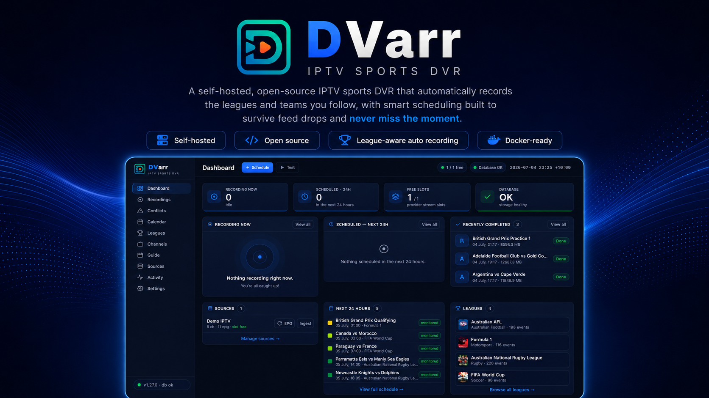

<p align="center">
  
  
  
  
  
  
  <a href="https://discord.gg/Nb59pEzGb6"></a>
</p>

DVarr watches the leagues you follow on [TheSportsDB](https://www.thesportsdb.com/), maps them to your IPTV channels, and records every event automatically — with a recorder built to survive feed drops, a scheduler that plans around your provider's stream limits, and guide intelligence that picks the channel actually showing each game.

---

## Highlights

- **Bulletproof recorder** — supervised, segmented MPEG-TS capture (`-c copy`) that relaunches on stall and concatenates losslessly. A feed blip costs you the blip, not the event. GPU-accelerated dead-feed detection spots a channel stuck on a black/frozen slate and fails over to the next ranked channel.
- **League automation** — add a league once; events, posters and season data sync from TheSportsDB. Follow a whole league, just one team (only their fixtures are scheduled), or — for motorsport — exactly the sessions you care about (Qualifying + Race, skip the practice grind).
- **Sport-aware recording lengths** — an F1 practice, qualifying or sprint session books an hour; the race keeps a full three-hour window. Five resolution tiers mean a sensible default always exists and your override always wins.
- **Smart auto-stop** — near the scheduled end, DVarr polls the live score and *extends* the recording in 15-minute steps while the match is still in play. Extra time and penalty shoot-outs land in the file; a race ending is never trimmed.
- **Match-aware channel picking** — mappings are ranked fallbacks with optional pinning, and can be scoped to a **single team** for leagues where each club airs on its own channel — one mapping per team, no guesswork. From 48 hours out, DVarr re-checks the EPG (refreshing it if stale) and re-picks the channel actually showing your event, so a late move to a national broadcaster can't hijack the recording.
- **Works out of the box** — the official image ships with a built-in TheSportsDB key (no sign-up needed), and every time in the app follows your **Display timezone** setting, wherever in the world you and your server are.
- **A real library** — finished recordings graduate to a **Library** page organised the way Plex/Jellyfin see them (league → season → game), showing exactly what's physically on the drive: sizes, quality, duration, free disk space. Watch any file **in the browser**, delete it (file + artwork + emptied folders) with one click, and a reconciling disk scan adopts files DVarr didn't create and flags files that vanished. You can even **watch a recording while it's still recording** — played from the capture on disk, so it never costs a provider stream slot.
- **Guide + calendar** — a fast EPG grid (click a programme to schedule it), a monthly calendar of everything followed, and a token-secured **ICS feed** you can subscribe to from Google Calendar.
- **Mobile PWA** — install it on your phone; drawer navigation, card layouts and touch-sized controls, with zero functionality lost.
- **Login with trusted devices** — HTTP Basic for scripts and automations, a cookie login page for browsers (180-day trusted devices), credentials set via Docker env vars, and a rate-limited login endpoint. Machine-to-machine surfaces (Plex, Home Assistant, IPTV export, health) carry their own tokens and stay reachable.
- **Integrations** — Plex custom metadata provider, Jellyfin/Emby-ready NFO + artwork on every filed recording, Sonarr-v3-compatible API, Home Assistant status endpoint, credential-free M3U/XMLTV export for LAN IPTV players.

---

## Screenshots

### Leagues — every league's mapped channels in one place; map a whole league or a single team, and drag the grip to reorder priority

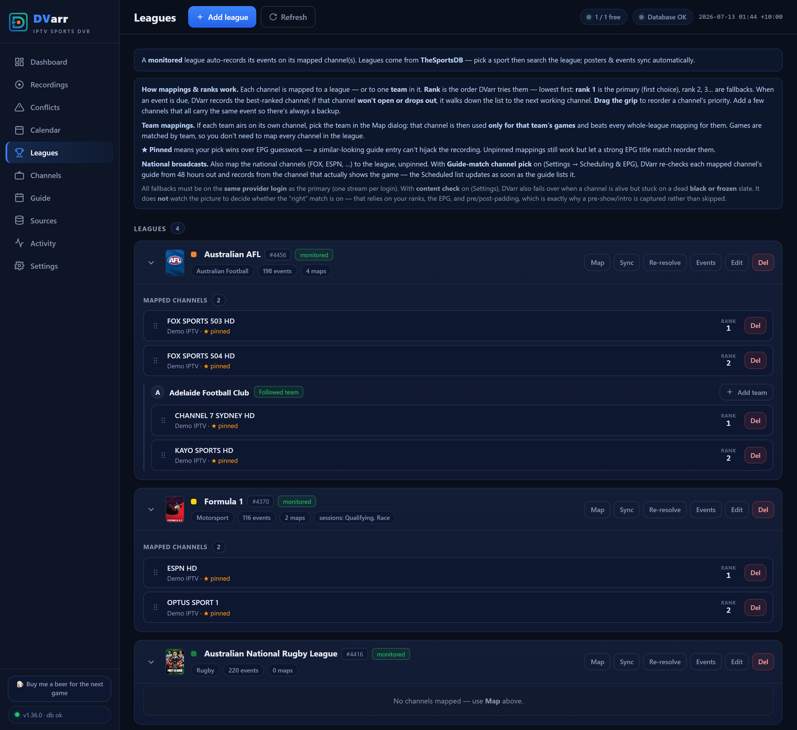

### Guide — click a programme to schedule it

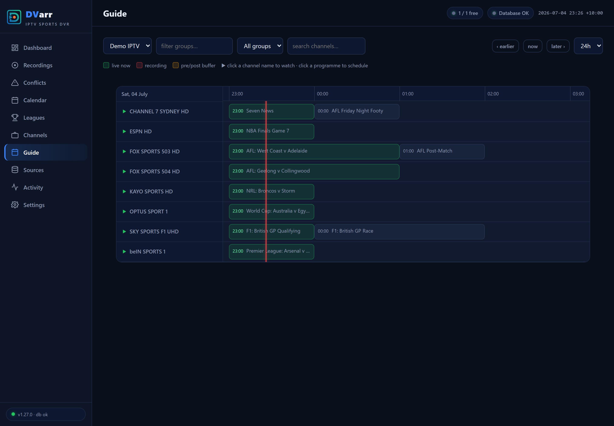

### Calendar — every followed event at a glance (one-click ICS subscribe for Google/Apple Calendar)

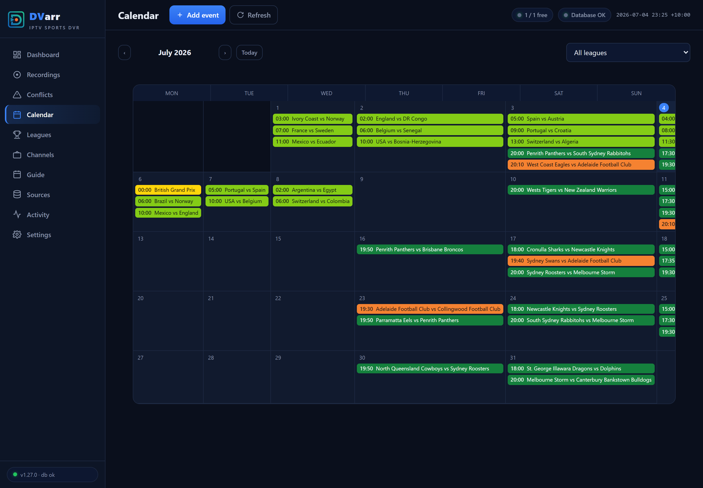

### Plex — a built-in metadata provider, explained right in Settings

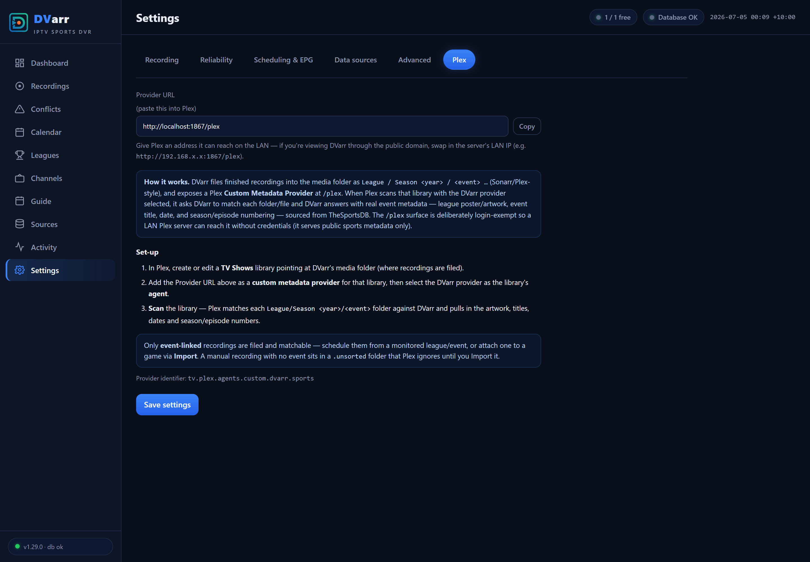

### Recordings & Settings

| Recordings | Settings |
|---|---|
| 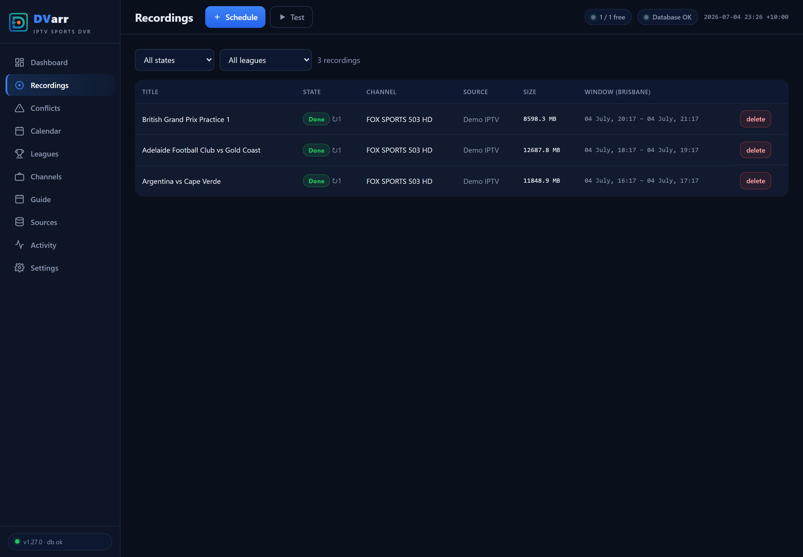 | 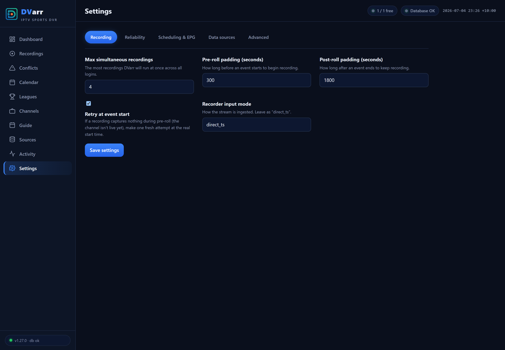 |

### Mobile PWA

| Dashboard | Drawer | Guide |
|---|---|---|
| 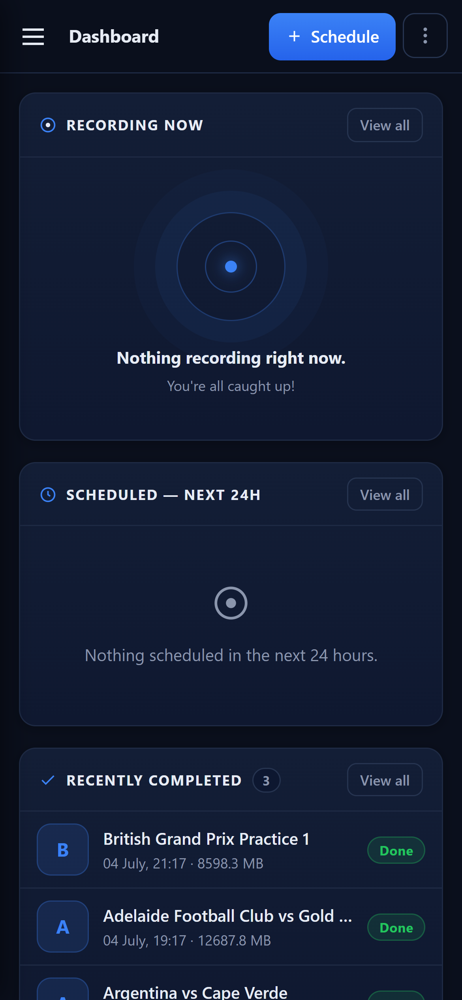 | 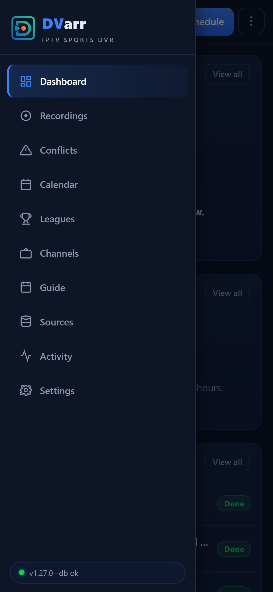 | 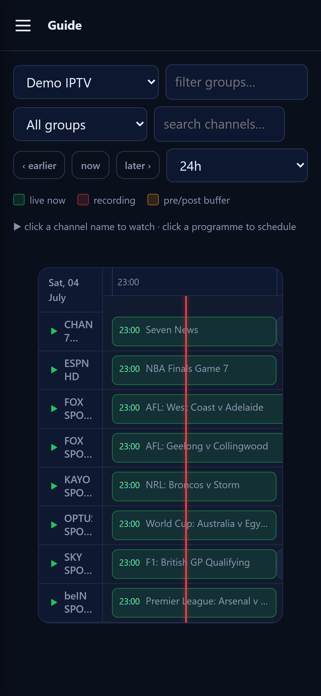 |

### Login — trusted devices stay signed in for 180 days

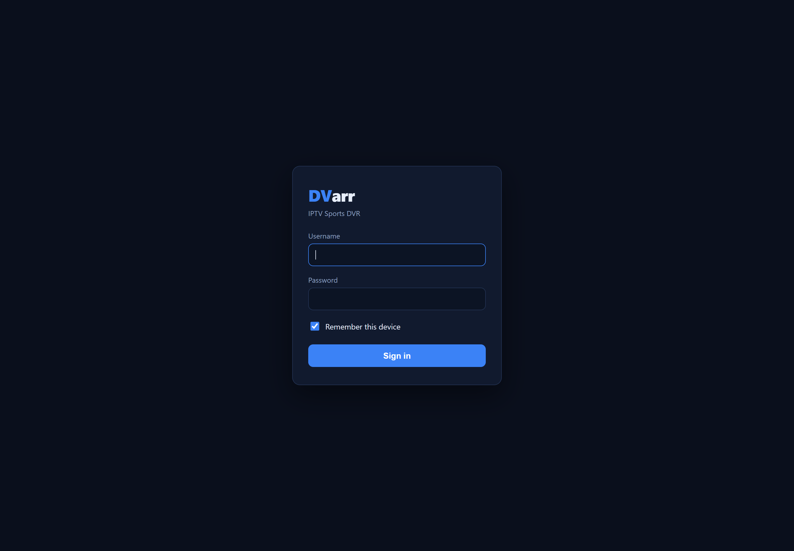

---

## Install

### Unraid (Community Apps) — the easy way

DVarr is on **Unraid Community Apps**: open the **Apps** tab, search **DVarr**, install, and set the three paths — `/config` → appdata; `/media` → your sports library; `/segments` → a **hidden scratch path outside your media library** (e.g. `/mnt/user/media/.dvarr-segments`, see the folder note below) — plus your web-UI username and password. Updates arrive through Unraid's normal container-update flow.

### Docker / Docker Compose

The official image is on GHCR (and includes the built-in TheSportsDB key):

```bash
docker pull ghcr.io/haydenw22/dvarr:latest
```

```yaml
services:
  dvarr:
    image: ghcr.io/haydenw22/dvarr:latest
    container_name: DVarr
    restart: unless-stopped
    ports:
      - "1867:1867"
    environment:
      - DVARR_AUTH_USER=${DVARR_AUTH_USER:-user}
      - DVARR_AUTH_PASS=${DVARR_AUTH_PASS:-password}
    volumes:
      - /path/to/appdata:/config
      - /path/to/media:/media
      - /path/to/segments:/segments
```

Put real credentials in an untracked `.env` file next to the compose file:

```env
DVARR_AUTH_USER=yourname
DVARR_AUTH_PASS=a-long-random-password
```

| Mount | Purpose |
|---|---|
| `/config` | SQLite DB + settings — small; put it on a fast disk (SSD/NVMe) |
| `/media` | Finished recordings, filed into Plex/Jellyfin-scannable `League / Season / Event` show folders |
| `/segments` | In-flight capture scratch (several GB per recording), auto-cleaned after each recording finalizes |

> **⚠ Keep `/segments` out of the folder your media server scans.** Putting it on the **same filesystem** as `/media` is ideal — finalizing a recording becomes an instant move instead of a copy — but point it at a **hidden or sibling** path, e.g. `/mnt/user/media/.dvarr-segments` (the leading dot hides it from Plex/Jellyfin). **Do not nest it inside your media library** (like `.../sports/segments`); if you do, it turns up as a bogus "segments" entry in Plex/Jellyfin.

> **What DVarr puts in `/media`:** only your **league show folders**, a hidden **`.unsorted`** staging folder (recordings it couldn't match to an event), and — briefly, while a recording finalizes — a flat `.mkv` at the root before it's filed. It creates nothing else, so any other folder you see there came from somewhere else (a previous DVR app, or your media server's own Live-TV/DVR recording path pointed at the same folder).

> **Provider model:** typical IPTV providers allow **one stream per login**, so DVarr's concurrency comes from multiple credentials (one tuner slot each). Fallback channels are structurally restricted to the same login — the schema itself rejects a cross-credential fallback.

### Build from source

The repo's [`docker-compose.yml`](docker-compose.yml) builds the multi-stage [`Dockerfile`](Dockerfile) (the .NET app + bundled ffmpeg) locally:

```bash
git clone https://github.com/haydenw22/DVarr.git
cd DVarr
# edit docker-compose.yml volume paths, then:
docker compose up -d --build
# UI → http://<host>:1867   ·   health → http://<host>:1867/api/health
```

A locally-built image doesn't include the bundled TheSportsDB key — paste your own under **Settings → Data sources**, or supply `DVARR_TSDB_API_KEY` in the environment.

---

## Full setup guide

Five steps from empty container to fully automatic sports DVR: **log in → add your IPTV source → ingest channels + EPG → add a league → map it to channels.** Everything after that — event sync, scheduling, conflict planning, recording, filing for Plex — is automatic.

League data works out of the box: the official image ships with a built-in [TheSportsDB](https://www.thesportsdb.com/) key, so the full catalogue and fixture sync need no sign-up. Prefer your own premium (v2) key? Paste it under **Settings → Data sources → TheSportsDB API key** and it takes over.

### 1 · First login

Browse to `http://<host>:1867`. Sign in with the credentials you configured (defaults are `user` / `password` — the container log warns until you change them). Tick **Trust this device** and the cookie lasts 180 days.

While you're there, set **Settings → Data sources → Display timezone** to your IANA zone (e.g. `America/New_York`). Every time in the app — calendar, guide, recording windows — plus recording file dates and Plex air dates follow it, applied the moment you save.

### 2 · Add your IPTV source

**Sources → Add source**, then fill in the details from your IPTV provider:

| Field | What to enter |
|---|---|
| **Label** | Any name, e.g. `My IPTV (login 1)` |
| **Type** | `xtream` for Xtream-codes providers (the common case), or `m3u` |
| **Protocol / Host / Port** | From your provider's URL, e.g. `http` · `provider.example.com` · `8080` |
| **Username / Password** | Your IPTV login |
| **Max streams** | How many concurrent streams this login allows (usually **1**) |
| **External EPG URL** *(optional)* | A full XMLTV URL (`https://…/epg.xml.gz`) if you prefer an external guide over the provider's built-in one — tick the override checkbox to make it win |
| **User-Agent** *(optional)* | Only if your provider requires a specific player UA |

Save, then on the source's row click:

- **Ingest** — pulls the full channel list (uses one stream slot briefly). Channels land on the **Channels** page, filterable by provider group.
- **EPG** — pulls the TV guide (from the provider's XMLTV, or your external URL). The toast reports how many programmes matched how many channels.

Have multiple logins with the same provider? Add each as its **own source** — each becomes a tuner slot, and DVarr spreads simultaneous recordings across them.

### 3 · Keep the EPG fresh (recommended)

**Settings → Scheduling & EPG**:

- **Auto-sync enabled** — refreshes every source's guide once a day.
- **EPG sync time / timezone** — pick a quiet hour in your local timezone.
- **EPG re-pick** (on by default) — from 48 hours out, DVarr re-checks each mapped channel's guide and records from the channel *actually showing the event*; the Scheduled list updates as soon as the guide lists the game.

### 4 · Add a league

**Leagues → Add league**:

1. Pick a **Sport**, then find your **League** with the search box (or paste a TheSportsDB league id for anything unlisted).
2. Choose what to follow:
   - **Team sports** — a *Teams to follow* list appears. Tick your team(s) to record only their fixtures; tick none (or all) to record every match.
   - **Motorsport** — a *Sessions to record* list appears (Practice / Qualifying / Sprint / Race). Follow just Quali + Race if that's your thing, with optional per-session length overrides.
3. Recording behaviour (the defaults are sensible):
   - **Recording stop** — *Auto* extends the recording in 15-minute steps while TheSportsDB still shows the event live (up to **Max extension**); *Fixed window* records exactly the scheduled slot.
   - **Auto-schedule horizon** — how many days ahead DVarr plans recordings (default 14).
   - **Calendar colour** — the league's colour on the Calendar page.
   - **Monitored** — leave ticked for automatic recording.
4. Save, then hit **Sync** on the league's row to pull its fixtures immediately.

### 5 · Map the league to channels

Recording needs to know *where* the league airs. On the league's row click **Map**:

1. Pick **Source → Group → Channel** (the channel box is a keyword search — type `bein`, `fox 503`, whatever matches).
2. **Team** *(optional, team sports)* — scope the mapping to one team's games. If every club airs on its own channel (the norm for US regional sports networks), add one mapping per team and each game records from its own team's channel automatically. A team mapping always beats a whole-league one for that team's games.
3. **Rank** — 1 is the first choice; add more mappings at rank 2, 3… as fallbacks. If rank 1 won't open or dies mid-event, DVarr fails over down the list automatically.
4. **Pinned** — your pick beats EPG title-guessing. Leave it on unless you want DVarr free to reorder by guide match.

For **national broadcasts** (a game moved to FOX/ESPN and the like), also map those channels to the league, unpinned — the guide-match re-pick checks each mapped channel's EPG shortly before start and records from the channel actually listing the game.

All fallbacks for a league must be on the **same provider login** — one stream per login means a mid-recording failover can't jump credentials (the schema enforces this).

**That's the setup done.** The dashboard shows what's planned; the Calendar shows every followed event; recordings start, survive drops, auto-extend, then get filed into `/media` with posters and `.nfo` metadata, ready for Plex or Jellyfin.

### 6 · Optional extras

> **How the media folder works:** DVarr creates each league's folder — along with its `tvshow.nfo`, poster, season art and episode metadata — **when the first recording is filed**, not before. If your media folder has leftover league folders from another tool (Sportarr etc.), delete the empty ones: a bare folder named "NFL" with no metadata is exactly what makes a media server's online providers mis-match it to a random TV show.

- **Plex** — DVarr ships a Plex Custom Metadata Provider (Plex 1.43+). In Plex: **Settings → Metadata Agents → Add Provider** → `http://<dvarr-lan-ip>:1867/plex` → restart Plex → point a **TV Shows** library at the DVarr agent. Real game titles and TheSportsDB artwork on every recording. Full instructions live in **DVarr → Settings → Plex**.
- **Jellyfin / Emby** — no plugin needed; DVarr writes everything locally (`tvshow.nfo`, episode `.nfo`s, posters, season art, episode thumbnails):
  1. Add a **Shows** library pointing at DVarr's media folder.
  2. In that library's settings, enable the **Nfo** metadata reader and **untick the internet metadata downloaders** (TMDB/TVDB/etc.). With internet providers left on, Jellyfin "corrects" league names into whatever TV show matches the folder name — "NFL" becomes *Inside the NFL*, "NHL" becomes *NHL News* — and keeps overwriting DVarr's metadata.
  3. After your first recording is filed, run **Refresh metadata → Replace all metadata** on the library once, so any earlier wrong guesses are flushed.
- **Calendar subscription** — Calendar page → **Subscribe (ICS)** for a token-secured feed Google/Apple Calendar can poll. Set **Settings → Data Sources → Public base URL** if you access DVarr through a reverse proxy.
- **Home Assistant** — set a webhook URL under **Settings → Data Sources** to push recording state changes; a status endpoint is also available for polling.
- **IPTV players on your LAN** — credential-free M3U + XMLTV export endpoints let players tune channels without ever seeing your provider login.
- **Live preview GPU accel** — recording never needs a GPU, but the in-browser live preview transcodes; on an NVIDIA box enable the commented `runtime: nvidia` block in the compose file and set **Settings → Reliability → content_verify_hwaccel** to `cuda` for GPU dead-feed checks too.

---

## How recording lengths are resolved

Every event gets its window from the first tier that answers — so a sensible default always exists, and anything you set explicitly always wins:

| Tier | Source | Example |
|---|---|---|
| 0 | **Your per-session map** on the league (motorsport) | "Sprint = 90 min, everything else default" |
| 1 | **Per-league override** | "Everything in this league is 2.5 h" |
| 2 | **Built-in motorsport session defaults** | Practice / Qualifying / Sprint → **1 h** · Race / Testing → **3 h** |
| 3 | **Per-sport defaults** | Fighting 5 h · Golf 6 h · Cricket & Tennis 4 h · Motorsport 3 h |
| 4 | **Global default** | 2 h |

Two safety nets sit under all of this: every recording carries post-padding, and **smart auto-stop** keeps extending a live recording past its scheduled end while the guide still shows it in play — so a tight default can't truncate a session that runs long.

---

## Local development

```powershell
dotnet build src/DVarr/DVarr.csproj
dotnet run --project src/DVarr/DVarr.csproj
# → http://localhost:1867  (login: user / password unless env vars are set)
```

On Windows, runtime data (SQLite DB, segments) goes to `src/DVarr/bin/Debug/net8.0/_localdata/` so it runs without the Linux `/config` mounts. The **Quick test recording** card records a public test stream — the provider is never contacted unless you explicitly ingest a source.

Migrations (applied automatically on startup):

```powershell
dotnet ef migrations add <Name> --project src/DVarr/DVarr.csproj --output-dir Data/Migrations
```

---

## Architecture

- **Stack:** .NET 8 (ASP.NET Core minimal APIs), EF Core + SQLite (WAL, single serialized writer), vanilla-JS SPA, one Docker container, ffmpeg for capture/concat/preview (NVDEC/NVENC when a GPU is present).

```
src/DVarr/
  Program.cs                  # host, DI, startup migrate + seed
  Data/                       # DbContext, entities, EF migrations, enum→TEXT mapping
  Infrastructure/             # epoch-UTC time, WAL pragmas, single-writer gate, auth middleware
  Services/
    Recording/                # segmented recorder + supervisor, smart auto-stop, live preview
    Scheduling/               # durable scheduler (arm/resume/missed)
    Tuner/                    # per-credential tuner-lease pool, cross-login spreading
    Ingest/                   # Xtream channel ingest + XMLTV EPG ingest
    Events/                   # TheSportsDB sync, auto-scheduler, conflict planner,
                              #   channel resolver + EPG re-pick, session classifier
    Media/                    # finished-file import: .nfo, artwork, Sonarr/Plex-style folders
  Api/                        # REST + SSE endpoints, calendar feed, auth, Plex/Sonarr/HA parity
  wwwroot/                    # SPA (PWA: manifest + service worker)
Dockerfile                    # multi-stage build + ffmpeg runtime
```

**Invariants the design enforces:**

- Every stored/wire time is a **UTC epoch second** — a naive local datetime is unrepresentable, so timezone double-conversion bugs can't exist.
- A **cross-credential fallback is unrepresentable** — a composite foreign key ties every fallback to the primary's provider login.
- **One writer, WAL, `busy_timeout`** — "database is locked" storms can't recur.
- Recordings are **never orphaned by a re-sync** — events upsert by a stable natural key; nothing is deleted or re-keyed.

See [`CHANGELOG.md`](CHANGELOG.md) for the full per-version history.

---

## Community

Questions, feature ideas, or just want to talk sport? [**Join the DVarr Discord**](https://discord.gg/Nb59pEzGb6) — setup help in `#support`, ideas in `#feature-requests`, bugs in `#bug-reports` (confirmed ones get tracked here on GitHub), and `#sport-chat` for match-day company.

---

## Support the project

DVarr is free and always will be. If it's recording your games reliably and you want to say thanks, you can [buy me a beer for the next game on Ko-fi](https://ko-fi.com/haydenw22) 🍺 — there's also a link at the bottom of the app's sidebar.

---

## License

DVarr is free software, released under the [GNU GPL v3.0](LICENSE) — the same license family as Sonarr and Radarr. Use it, modify it, share it; derivatives stay open.
