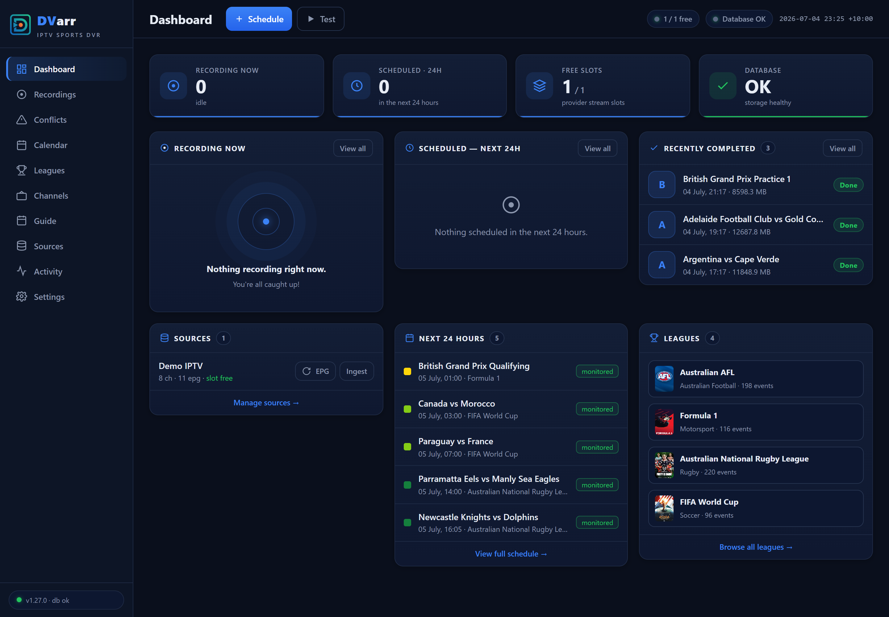

<p align="center">
  
</p>

<h1 align="center">DVarr</h1>

<p align="center"><b>Self-hosted IPTV sports DVR with one overriding job: never miss a can't-miss live sports event.</b></p>

<p align="center">
  
  
  
  
</p>



DVarr watches the leagues you follow on [TheSportsDB](https://www.thesportsdb.com/), maps them to your IPTV channels, and records every event automatically — with a recorder built to survive feed drops, a scheduler that plans around your provider's stream limits, and guide intelligence that picks the right channel an hour before kick-off.

---

## Highlights

- **Bulletproof recorder** — supervised, segmented MPEG-TS capture (`-c copy`) that relaunches on stall and concatenates losslessly. A feed blip costs you the blip, not the event. GPU-accelerated dead-feed detection spots a channel stuck on a black/frozen slate and fails over to the next ranked channel.
- **League automation** — add a league once; events, posters and season data sync from TheSportsDB. Follow a whole league, just one team (only their fixtures are scheduled), or — for motorsport — exactly the sessions you care about (Qualifying + Race, skip the practice grind).
- **Sport-aware recording lengths** — an F1 practice, qualifying or sprint session books an hour; the race keeps a full three-hour window. Five resolution tiers mean a sensible default always exists and your override always wins.
- **Smart auto-stop** — near the scheduled end, DVarr polls the live score and *extends* the recording in 15-minute steps while the match is still in play. Extra time and penalty shoot-outs land in the file; a race ending is never trimmed.
- **Match-aware channel picking** — mappings are ranked fallbacks with optional pinning. An hour before start, DVarr re-checks the EPG (refreshing it if stale) and re-picks the channel actually showing your event, so a late programming change can't hijack the recording.
- **Guide + calendar** — a fast EPG grid (click a programme to schedule it), a monthly calendar of everything followed, and a token-secured **ICS feed** you can subscribe to from Google Calendar.
- **Mobile PWA** — install it on your phone; drawer navigation, card layouts and touch-sized controls, with zero functionality lost.
- **Login with trusted devices** — HTTP Basic for scripts and automations, a cookie login page for browsers (180-day trusted devices), credentials set via Docker env vars, and a rate-limited login endpoint. Machine-to-machine surfaces (Plex, Home Assistant, IPTV export, health) carry their own tokens and stay reachable.
- **Integrations** — Plex custom metadata provider, Sonarr-v3-compatible API for Prowlarr, Home Assistant status endpoint, credential-free M3U/XMLTV export for LAN IPTV players.

---

## Screenshots

### Leagues — follow a league, a team, or just the sessions you want


### Guide — click a programme to schedule it


### Calendar — every followed event at a glance (plus an ICS feed for Google Calendar)


### Recordings & Settings

| Recordings | Settings |
|---|---|
|  |  |

### Mobile PWA

| Dashboard | Drawer | Guide |
|---|---|---|
|  |  |  |

### Login — trusted devices stay signed in for 180 days


---

## How recording lengths are resolved

Every event gets its window from the first tier that answers — so a sensible default always exists, and anything you set explicitly always wins:

| Tier | Source | Example |
|---|---|---|
| 0 | **Your per-session map** on the league (motorsport) | "Sprint = 90 min, everything else default" |
| 1 | **Per-league override** | "Everything in this league is 2.5 h" |
| 2 | **Built-in motorsport session defaults** | Practice / Qualifying / Sprint → **1 h** · Race / Testing → **3 h** |
| 3 | **Per-sport defaults** | Fighting 5 h · Golf 6 h · Cricket & Tennis 4 h · Motorsport 3 h |
| 4 | **Global default** | 2 h |

Two safety nets sit under all of this: every recording carries post-padding, and **smart auto-stop** keeps extending a live recording past its scheduled end while the guide still shows it in play — so a tight default can't truncate a session that runs long.

---

## Quick start (Docker Compose)

```yaml
services:
  dvarr:
    build: .
    image: dvarr:latest
    container_name: DVarr
    restart: unless-stopped
    ports:
      - "1867:1867"
    environment:
      - TZ=Australia/Brisbane
      - DVARR_AUTH_USER=${DVARR_AUTH_USER:-user}      # set real creds in an untracked .env
      - DVARR_AUTH_PASS=${DVARR_AUTH_PASS:-password}  # never commit them
    volumes:
      - /path/to/appdata:/config      # SQLite DB + settings (fast disk)
      - /path/to/media:/media         # finished recordings (Plex-scannable)
      - /path/to/segments:/segments   # in-flight capture scratch, auto-cleaned
```

```bash
docker compose up -d --build
# UI → http://<host>:1867   ·   health → http://<host>:1867/api/health
```

Then, in the UI: add your IPTV source (Xtream credentials) under **Sources**, ingest channels + EPG, add a league under **Leagues**, and map it to a channel. Everything else — event sync, scheduling, conflict planning, recording, filing for Plex — is automatic.

An Unraid Community Apps template ships in [`deploy/dvarr.xml`](deploy/dvarr.xml). The real production compose file (GPU pinning, Unraid volume mapping) is [`docker-compose.yml`](docker-compose.yml).

> **Provider model:** typical IPTV providers allow **one stream per login**, so DVarr's concurrency comes from multiple credentials (one tuner slot each). Fallback channels are structurally restricted to the same login — the schema itself rejects a cross-credential fallback.

---

## Local development

```powershell
dotnet build src/DVarr/DVarr.csproj
dotnet run --project src/DVarr/DVarr.csproj
# → http://localhost:1867  (login: user / password unless env vars are set)
```

On Windows, runtime data (SQLite DB, segments) goes to `src/DVarr/bin/Debug/net8.0/_localdata/` so it runs without the Linux `/config` mounts. The **Quick test recording** card records a public test stream — the provider is never contacted unless you explicitly ingest a source.

Migrations (applied automatically on startup):

```powershell
dotnet ef migrations add <Name> --project src/DVarr/DVarr.csproj --output-dir Data/Migrations
```

---

## Architecture

- **Stack:** .NET 8 (ASP.NET Core minimal APIs), EF Core + SQLite (WAL, single serialized writer), vanilla-JS SPA, one Docker container, ffmpeg for capture/concat/preview (NVDEC/NVENC when a GPU is present).

```
src/DVarr/
  Program.cs                  # host, DI, startup migrate + seed
  Data/                       # DbContext, entities, EF migrations, enum→TEXT mapping
  Infrastructure/             # epoch-UTC time, WAL pragmas, single-writer gate, auth middleware
  Services/
    Recording/                # segmented recorder + supervisor, smart auto-stop, live preview
    Scheduling/               # durable scheduler (arm/resume/missed)
    Tuner/                    # per-credential tuner-lease pool, cross-login spreading
    Ingest/                   # Xtream channel ingest + XMLTV EPG ingest
    Events/                   # TheSportsDB sync, auto-scheduler, conflict planner,
                              #   channel resolver + EPG re-pick, session classifier
    Media/                    # finished-file import: .nfo, artwork, Sonarr/Plex-style folders
  Api/                        # REST + SSE endpoints, calendar feed, auth, Plex/Sonarr/HA parity
  wwwroot/                    # SPA (PWA: manifest + service worker)
deploy/dvarr.xml              # Unraid Community Apps template
Dockerfile                    # multi-stage build + ffmpeg runtime
```

**Invariants the design enforces:**

- Every stored/wire time is a **UTC epoch second** — a naive local datetime is unrepresentable, so timezone double-conversion bugs can't exist.
- A **cross-credential fallback is unrepresentable** — a composite foreign key ties every fallback to the primary's provider login.
- **One writer, WAL, `busy_timeout`** — "database is locked" storms can't recur.
- Recordings are **never orphaned by a re-sync** — events upsert by a stable natural key; nothing is deleted or re-keyed.

See [`CHANGELOG.md`](CHANGELOG.md) for the full per-version history.
